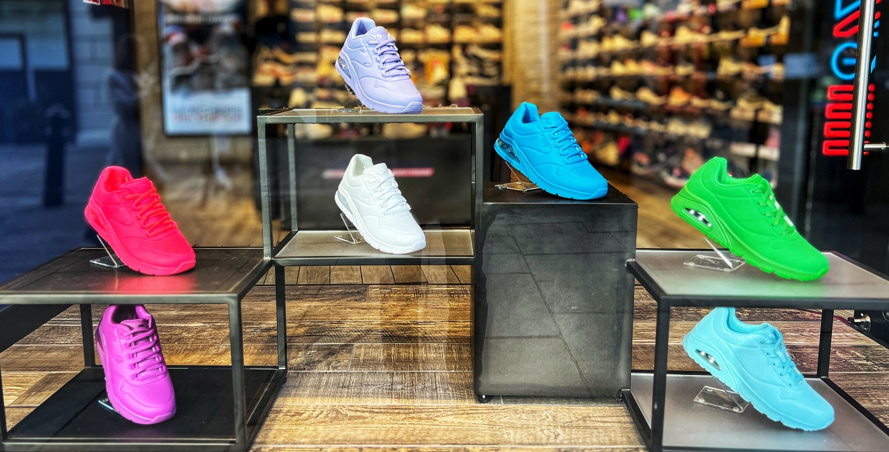

<p align="center">
  
</p>
# Analyzing Online Sports Revenue

EDA on Adidas and Nike product data to see how price tier and description length relate to revenue, ratings, and reviews.

## Context

Based on a [DataCamp](https://www.datacamp.com/) guided project. You play product analyst for an online sports clothing company and use product, finance, and review data to surface insights for marketing and sales.

This project focuses on **pandas data wrangling and exploratory analysis** — merging tables, cleaning nulls, binning continuous features, and aggregating metrics by category.

## What I learned / Key concepts

- Loading and joining multiple CSVs with `pd.merge` on `product_id`
- Cleaning with `dropna()` after the join
- Price segmentation with `pd.qcut` (quartiles → Budget / Average / Expensive / Elite)
- Description-length bins with `pd.cut` and `.str.len()`
- Grouped aggregations with `.groupby().agg()` (`count`, `mean`, `sum`)
- Rounding numeric summaries for readable output
- Libraries: **pandas**, **numpy**

## Dataset

Four product-level CSVs (each ~3,179 rows), linked by `product_id`:

| File | Contents |
|------|----------|
| `brands.csv` | Brand (`Adidas` / `Nike`) |
| `finance.csv` | Listing price, sale price, discount, revenue |
| `info.csv` | Product name and description |
| `reviews.csv` | Average rating and review count |

Some rows have missing values (e.g. incomplete brand/finance/review fields); those are dropped after merging.

## Tech stack

- Python 3
- pandas
- numpy
- Jupyter Notebook

*(No `requirements.txt` in the repo — install the two libraries above.)*

## How to run

```bash
# from this folder
python -m venv .venv

# Windows
.venv\Scripts\activate

# macOS / Linux
# source .venv/bin/activate

pip install pandas numpy jupyter

jupyter notebook notebook.ipynb
```

Then run all cells top to bottom. Outputs print as tables in the notebook.

## Results / Key findings

### 1. Brand × price label (mean revenue)

Listing price was split into four quartile labels. Product counts and mean revenue:

| Brand | Price label | Products | Mean revenue |
|-------|-------------|----------|--------------|
| Adidas | Budget | 574 | 2,015.68 |
| Adidas | Average | 655 | 3,035.30 |
| Adidas | Expensive | 759 | 4,621.56 |
| Adidas | Elite | 587 | **8,302.78** |
| Nike | Budget | 357 | 1,596.33 |
| Nike | Average | 8 | 675.59 |
| Nike | Expensive | 47 | 500.56 |
| Nike | Elite | 130 | 1,367.45 |

**Takeaways from the output:** Adidas has far more products across every tier, and mean revenue rises steadily with price label (highest on Elite). Nike’s catalog is skewed toward Budget and Elite, with almost no “Average” products, and mean revenue is lower than Adidas at every tier.

### 2. Description length vs ratings & reviews

Description character length was binned (0–100, 100–200, …, 600–700):

| Length bin (upper) | Mean rating | Total reviews |
|--------------------|-------------|---------------|
| 100 | 2.26 | 36 |
| 200 | 3.19 | 17,719 |
| 300 | 3.28 | 76,115 |
| 400 | 3.29 | 28,994 |
| 500 | 3.35 | 4,984 |
| 600 | 3.12 | 852 |
| 700 | 3.65 | 818 |

**Takeaways:** Very short descriptions (≤100 chars) have the lowest mean rating and almost no reviews. Most review volume sits in the 200–400 character range. Mean rating is generally higher for longer descriptions, peaking at the 700 bin (3.65), though that bin has fewer reviews than the mid-length range.

## Project structure

```
workspace/
├── notebook.ipynb   # analysis
├── brands.csv
├── finance.csv
├── info.csv
├── reviews.csv
└── README.md
```
